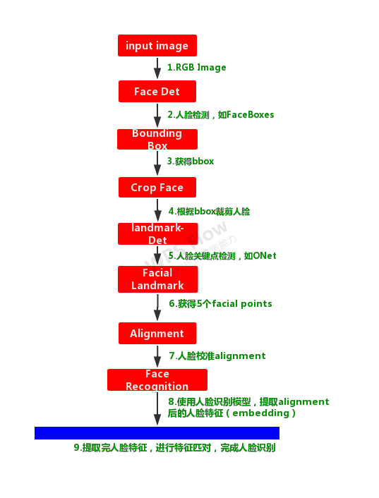

# face-recognition
基于IR_ResNet的人脸识别模型
## 1. 目录结构

```
├── data      # 人脸测试数据集,两个ID,每个ID50张人脸图片
│   ├── 1                           # 人脸ID1
│   ├── 2                           # 人脸ID2
│   ├── test_image                  # 测试图片
│   └── face_embeddings.json        # 人脸data的特征embeddings(post_process后处理的特征)文件
├── face_alignment # 人脸校准Demo
├── face_landmark  # 人脸关键点检测Demo
├── demo.py    # 模型测试Demo
├── demo2.py   # 人脸识别Demo
├── md5sum.txt # 模型MD5文件
├── net        # 模型文件
├── README.md
├── requirements.txt
├── test1.png
├── test2.png
└── XMC2-Rec_face_recognition.pth.tar

```
## 2. Platform
- hardware: Intel Core i7-8700 CPU @ 3.20GHz × 12, GPU GeForce RTX 2070 8G
- Python-3.6
- Pillow-6.0
- Pytorch-1.1.0
- torchvision-0.3.0
- numpy-1.16.3


## 3. 输入图像预处理
```python
    transform = transforms.Compose([
        transforms.Resize([int(128 * input_size[0] / 112), int(128 * input_size[0] / 112)]),
        transforms.CenterCrop([input_size[0], input_size[1]]),
        transforms.ToTensor(),
        transforms.Normalize(mean=[0.5, 0.5, 0.5], std=[0.5, 0.5, 0.5]),
    ])

```
## 4. 模型输出embedding后处理函数

```python
def post_process(embeddings, axis=1):
    '''
    特征后处理函数,l2_norm
    :param embeddings:
    :param axis:
    :return:
    '''
    norm = torch.norm(embeddings, 2, axis, True)
    output = torch.div(embeddings, norm)
    return output
```

## 5. Run a demo

### 5.1 人脸识别模型测试Demo
```bash
python demo.py 
```

输出:

```
embeddings1.shape:torch.Size([1, 256])
embeddings1:tensor([ 0.0149, -0.0099, -0.0052, -0.0447,  0.0239,  0.0471, -0.0380, -0.0331,
         0.0461,  0.0730, -0.0211, -0.0543, -0.0185, -0.0290, -0.0241,  0.0269,
         0.0554, -0.0754, -0.0483,  0.0627], device='cuda:0')
embeddings2.shape:torch.Size([1, 256])
embeddings2:tensor([-0.0035, -0.0545, -0.0483, -0.0451, -0.0289,  0.0582, -0.0083,  0.0458,
        -0.0437,  0.1701, -0.0649,  0.0300,  0.0839, -0.0705,  0.0281, -0.0015,
         0.0770, -0.0030, -0.0270,  0.0600], device='cuda:0')
distance:[0.7085562],score:[0.9694457],same person:[ True]

```


### 5.2 人脸识别Demo
#### (1)人脸识别流程



#### (2)人脸识别Demo
```bash
python demo2.py 
```

输出:

```
landmarks1:[[29.571426, 64.567245], [78.07212, 62.441017], [53.48955, 96.782585], [40.05504, 126.16538], [73.83619, 124.19235]]
landmarks2:[[36.759026, 62.980865], [79.756775, 55.089237], [67.744415, 83.66307], [48.93322, 115.03057], [83.50806, 107.844574]]
embeddings1.shape:torch.Size([1, 256])
embeddings1:tensor([ 0.0149, -0.0099, -0.0052, -0.0447,  0.0239,  0.0471, -0.0380, -0.0331,
         0.0461,  0.0730, -0.0211, -0.0543, -0.0185, -0.0290, -0.0241,  0.0269,
         0.0554, -0.0754, -0.0483,  0.0627], device='cuda:0')
embeddings2.shape:torch.Size([1, 256])
embeddings2:tensor([-0.0035, -0.0545, -0.0483, -0.0451, -0.0289,  0.0582, -0.0083,  0.0458,
        -0.0437,  0.1701, -0.0649,  0.0300,  0.0839, -0.0705,  0.0281, -0.0015,
         0.0770, -0.0030, -0.0270,  0.0600], device='cuda:0')
distance:[0.7085562],score:[0.9694457],same person:[ True]

```

## 6. I/O

```
Input: 待处理人脸图像，type : tensor, size : (1,3,64,64)
Output: 输出为512维的人脸特征，type: tensor, size : (1,256)

```


## 8. 人脸识别测试结果

- 人脸特征embeddings测试输出结果:`data/face_embeddings.json`,格式为:{image_id: embeddings}


|Test|precision|recall|accuracy|
|:-----:|:-----:|:--------:|:--------:|
|X4_Face(1:20)|0.9983|0.9978|0.9981|
|X4_Face(1:50)|0.9921|0.9882|0.9908|
|lexue(1:36)|0.9587|0.9551|0.9567|
|NVR1(1:32)|0.9336|0.9239|0.9420|

