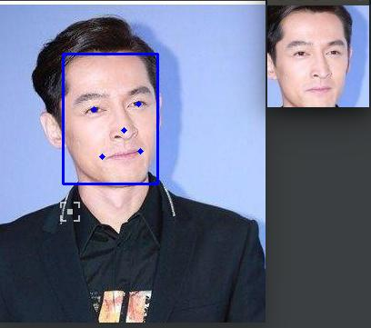

# face-alignment
利用MTCNN人脸检测的5个关键点进行人脸校准(face alignment)的算法

## 1. 目录结构

```
├── alignment           # alignment的工具包
│   ├── align_trans.py       # alignment处理函数
│   └── matlab_cp2tform.py   # alignment处理相关变换函数
├── data           # 人脸校准的工具包
│   ├── test_image                # alignment测试图片,共10张人脸
│   ├── test_image_detection.json # 测试图片的MTCNN检测结果,格式请参考face-detection仓库
│   └── alignment_out   # alignment处理后的人脸图像
├── demo.py             # 测试demo文件
├── test.jpg            # 测试图片
├── alignment.jpg       # demo测试输出的图片
├── requirements.txt    # 算法依赖的相关Python包
└── README.md
```

## 2. Platform
- hardware: Intel Core i7-8700 CPU @ 3.20GHz × 12, GPU GeForce RTX 2070 8G
- Python3.6
- Pillow-6.0
- numpy-1.16.3
- opencv-python 3.4.1


## 3. 算法接口
- 人脸校准算法需要先获取人脸参考关键点,再根据已知的关键点进行人脸校准
- `align_trans`主要提供两个接口`get_reference_facial_points`和`faces_alignment_crop`
- 接口参数说明如下:

#### 3.1 `align_trans.get_reference_facial_points`获取人脸参考关键点

```python
def get_reference_facial_points(output_size=None, inner_padding_factor=0.0, outer_padding=(0, 0), default_square=False):
    '''
    get reference 5 key points according to crop settings:
    0. Set default crop_size:
        if default_square:
            crop_size = (112, 112)
        else:
            crop_size = (96, 112)
    1. Pad the crop_size by inner_padding_factor in each side;
    2. Resize crop_size into (output_size - outer_padding*2),
        pad into output_size with outer_padding;
    3. Output reference_5point;
    :param output_size: (w, h) or None,size of aligned face image
    :param inner_padding_factor:  (w_factor, h_factor),padding factor for inner (w, h)
    :param outer_padding: (w_pad, h_pad), each row is a pair of coordinates (x, y)
    :param default_square: True or False,
        if True:
            default crop_size = (112, 112)
        else:
            default crop_size = (96, 112);
        make sure, if output_size is not None:
             (output_size - outer_padding) = some_scale * (default crop_size * (1.0 + inner_padding_factor))
    :return: reference_5point: 5x2 np.array, each row is a pair of transformed coordinates (x, y)
    '''
```

#### 3.2 `align_trans.faces_alignment_crop`进行人脸校准和裁剪

```python
def warp_and_crop_face(src_img, facial_pts, reference_pts=None, crop_size=(96, 112), align_type='smilarity'):
    '''
    apply affine transform 'trans' to uv
    :param src_img: np.array,input image
    :param facial_pts: could be
            1)a list of K coordinates (x,y)
            2) Kx2 or 2xK np.array
            each row or col is a pair of coordinates (x, y)
    :param reference_pts:  could be
            1) a list of K coordinates (x,y)
            2) Kx2 or 2xK np.array,each row or col is a pair of coordinates (x, y)
            3) None,if None, use default reference facial points
    :param crop_size: (w, h),output face image size
    :param align_type: transform type, could be one of
            1) 'similarity': use similarity transform
            2) 'cv2_affine': use the first 3 points to do affine transform,by calling cv2.getAffineTransform()
            3) 'affine': use all points to do affine transform
    :return: face_img, face image with size (w, h) = @crop_size
    '''
```

## 4. Demo例子

```bash
python demo.py 
```

## 5. 人脸校准测试结果

- 输入MTCNN人脸检测结果`bbox_score`和`landmarks`,例如:

```python 
    bbox_score = np.asarray([[69.48486808, 58.12609892, 173.92575279, 201.95947894, 0.99979943]])
    landmarks = np.asarray([[[103.97721, 119.6718],
                             [152.35837, 113.06249],
                             [136.67535, 142.62952],
                             [112.62607, 171.1305],
                             [154.60092, 165.12515]]])

```

- 人脸校准输出结果,左图是输入图像,右图是人脸校准结果图



- 更多测试结果,请查看`data/alignment_out`测试结果
